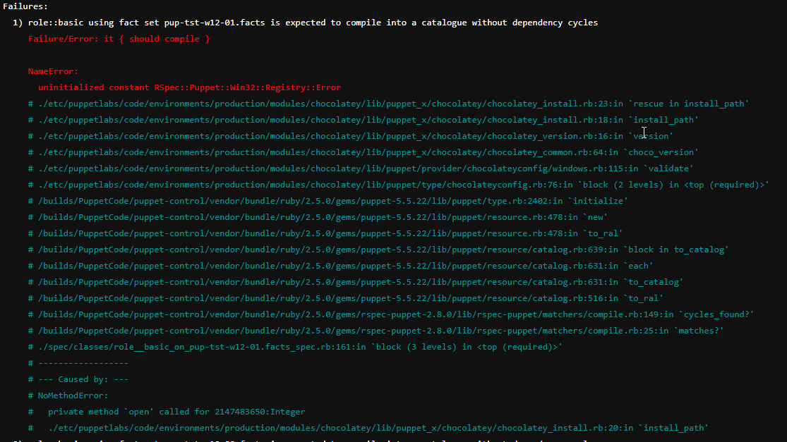

# chocolateycheck

This module is not for general usage, but to test out/check/fix the Chocolatey Unit Test error.



## Table of Contents

1. [Description](#description)
1. [Setup - The basics of getting started with chocolateycheck](#setup)
1. [Usage - Configuration options and additional functionality](#usage)

## Description

The error occurred, when the unit test is run on a non-Windows machine. Hence to reproduce
the error, one just has to run the unit test in a Linux/OSX machine.

There will be way to run the test in **Usage** section later.

Beside using the error from chocolatey here. One can isolate the error happening in
the big project here, hence staying focused on 1 problem at a time. The offending code
from the big project can be duplicated to here as a file or a snippets.

- Related Tickets

  [ https://github.com/dylanratcliffe/onceover/issues/287 ]()

  [ https://github.com/rodjek/rspec-puppet/issues/6911 ]()

  Main Ticket which seems to address or fix the problem. [ https://tickets.puppetlabs.com/browse/MODULES-10638 ]()

  The Git Pull which seems to address or fix the problem and introduce the code into the
  main branch. [ https://github.com/puppetlabs/puppetlabs-chocolatey/pull/254 ]()


## Setup

Although the original error was discovered via onceover. It is relying on PDK unit
aka rspec. To reduce the amount of overhead, we simulate the error on from the PDK
Unit Test level. Hence only PDK is needed to install. You check for pdk using
```
pdk --version
```

You can also duplicated error by copying the file or code snippets from your original
code into the manifest folder or the init.pp respectively. There is already a erroneous
sample chocolatey code at play in [init.pp](manifests/init.pp) .

## Usage

Once the erroneous codes are in place, we can start our test or simulation.
Run the following in the Non-Windows machine to see the error.

### To SEE THE ERROR ON A NON-WINDOWS MACHINE

```
make usechocolatey_ORG  usechocolateyDefaultFactsORG unittest_puppet5_5
```

### To Reset all the mods and the version (Older version : chocolatey 4.0.0 )

```
make usechocolatey_ORG  usechocolateyDefaultFactsORG
```


### Chocolatey version

- To Use a original older version (version : chocolatey 4.0.0 )
```
make usechocolatey_ORG
```

- To Use a newer version (NEW version : chocolatey 6.0.0 )
```
make usechocolatey_NEW
```

- To Use a newer and modded version (NEW version : chocolatey main @ https://github.com/puppetlabs/puppetlabs-chocolatey )
```
make usechocolatey_MODDED
```


### To Apply Fix
- To Reset to original Facts
```
make usechocolateyDefaultFactsORG
```

- To Apply fixes via Facts
```
make usechocolateyDefaultFactsMODDED
```


### To run unit test
- To run unit test with Puppet
```
make unitest
```

- To run unit test as Puppet 5.5
```
make unittest_puppet5_5
```


### Altogether Now

- To Reset all the mods and the version (Older version : chocolatey 4.0.0 ) and run unit test as Puppet 5.5

```
make usechocolatey_ORG  usechocolateyDefaultFactsORG unittest_puppet5_5
```


- To Apply all the mods and fixes  and run unit test as Puppet 5.5

```
make usechocolatey_MODDED  usechocolateyDefaultFactsMODDED unittest_puppet5_5
```
